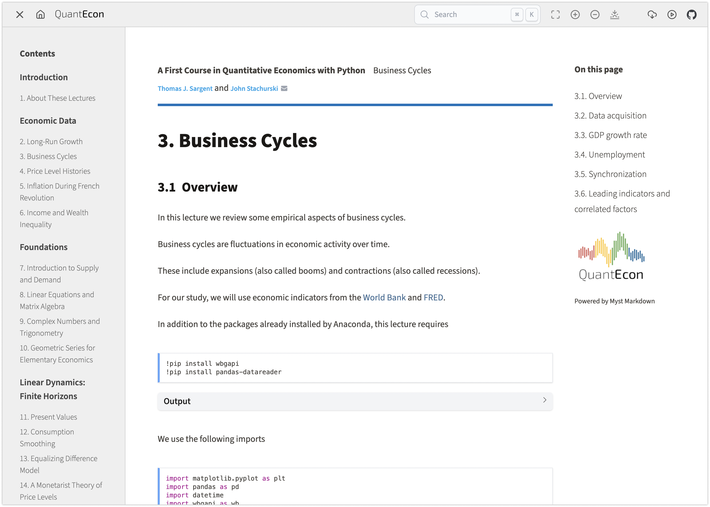

# QuantEcon Theme for MyST Markdown

A dedicated MyST interactive book theme for the QuantEcon lectures and books.

- Responsive and mobile ready
- Page Footer based on MyST Content
- Bundled QuantEcon brand assets



### Downloads

A when downloads are available on a page a download button will appear in the top toolbar.
The contents of the menu available from that button is configured via the [download configuration](https://mystmd.org/guide/website-downloads) of the MyST project and page.
Typically, a download of the entire book as a PDF is provided along with downloads of each lecture in PDF and Notebook (md) form.

To achieve this the following configuration should be added to build and expose the downloads.

At the project level:

```yaml
# myst.yml
project:
  ...
  exports:
    - id: book-pdf
      format: pdf
      template: plain_latex_book
      output: exports/quantecon-python-intro.pdf
  downloads:
    - id: book-pdf
      title: Book (PDF)
```

And then on each page:

```yaml
# long_run_growth.md
exports:
  - format: pdf
    template: plain_latex_book
    output: exports/long_run_growth.pdf
downloads:
  - file: exports/long_run_growth.pdf
    title: Lecture (PDF)
  - file: ./long_run_growth.md
    title: Notebook (md)
```

### Launch Notebooks

The launch notebooks capability has been developed to mirror capabilities in the previous QuantEcon theme. It is assumed that the `.notebooks` suffix convention for repository naming is used when launching both Google Colab and Private Jupyter Hub sessions.

## Usage with MyST

To use this template locally, update your site template make sure your project's local dependencies are installed:

```sh
site:
  template: https://github.com/curvenote-themes/quantecon/archive/refs/heads/main.zip
```

Then start the local server:

```sh
myst start
```

Open up [http://localhost:3000](http://localhost:3000) and you should be ready to go!

## Deployment

To deploy this theme see the [MyST Deployment Documentation](https://mystmd.org/guide/deployment).
